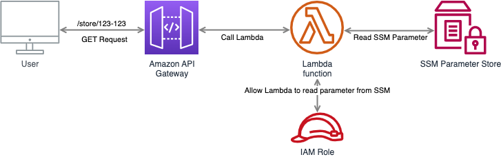

# Testing Lambda functions

<br><br>

## Description
This is a simple project showing how to test Lambda functions with different approaches.

## Prerequisite
 * Docker
 * AWS CDK CLI
 * AWS CLI
 * node.js
 * Python 3.12
 * Poetry

## Quick start
1. Clone the repo
   ```sh
   git clone https://github.com/sz3jdii/testing-lambda-functions.git
   ```
2. Install dependencies
    ```sh
    poetry install
    ```
3. Deploy the project
   ```sh
   ./deploy.sh
   ```

## Useful commands
 * `./lint.sh`          Fixes indents and checks your code quality
 * `./destroy.sh`       Triggers cdk destroy
 * `./deploy/sh`        Deploys stack to the AWS account
 * `pytest -vv ./tests` Run tests

## Useful links
* [AWS CDK](https://docs.aws.amazon.com/cdk/v2/guide/cli.html)

## Author
**Adam Świątkowski**
* [github/sz3jdii](https://github.com/sz3jdii)
* [Blog](https://cloudybarz.com/)

### License
Copyright © 2023, [Adam Świątkowski](https://github.com/sz3jdii).
Released under the [MIT License](LICENSE).

